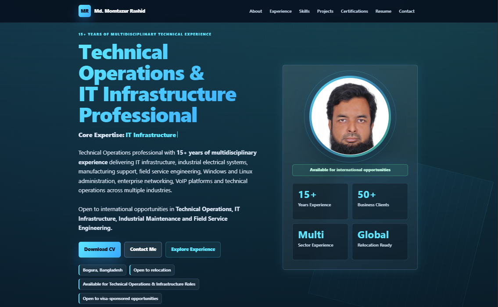

# Md. Momtazur Rashid — Professional Portfolio



Production-ready personal portfolio website showcasing 15+ years of experience in Technical Operations, IT Infrastructure, Industrial Electrical Engineering, Field Service Engineering, Networking, Linux Administration, VoIP Systems, and Manufacturing Operations.

## Source of Truth

The website content is based on the official professional resume and serves as the primary public portfolio.

The downloadable resume is the official reference document:

`assets/resume/Md_Momtazur_Rashid_Resume.pdf`

## Features

- Premium dark glassmorphism interface
- Recruiter-focused hero section
- Animated typing effect
- Professional circular profile photo presentation
- Experience timeline cards
- Grouped skills with animated meters
- Project cards with technologies and business impact
- Premium certification cards
- Contact section with email, phone, location, LinkedIn status, GitHub status, relocation, and visa-sponsorship availability
- Semantic HTML and accessibility-focused structure
- Keyboard-friendly mobile navigation
- Open Graph, Twitter Card, canonical URL, robots.txt, sitemap.xml, and JSON-LD schema
- Optimized WebP/JPEG profile images
- Cloudflare Pages and GitHub Pages compatible
- Lighthouse 100/100/100/100
- Fully responsive
- Performance optimized
- ATS-friendly recruiter-focused content

## Project Structure

```text
portfolio/
|-- index.html
|-- style.css
|-- script.js
|-- robots.txt
|-- sitemap.xml
|-- README.md
`-- assets/
    |-- images/
    |-- icons/
    `-- resume/
```

## Local Preview

Open `index.html` directly in a browser, or serve the folder with a static server:

```bash
# Option 1
python -m http.server 8080

# Option 2
npx serve
```

Then visit:

```text
http://localhost:8080/
```

## Cloudflare Pages Deployment

1. Push the project files to a GitHub repository.
2. Create a new Cloudflare Pages project from the repository.
3. Use these settings:
   - Framework preset: None
   - Build command: leave empty
   - Build output directory: `/`
4. Deploy.

If the repository contains this `portfolio` folder inside a larger repository, set the Cloudflare project root to `portfolio`.

## GitHub Pages Deployment

1. Push the contents of this folder to a repository.
2. Open repository Settings.
3. Go to Pages.
4. Select the branch and root folder.
5. Save and wait for GitHub Pages to publish.

## Live Portfolio

🌐 https://portfolio.s-manha-mm.workers.dev/

## SEO Domain

The current production URL used in metadata is:

`https://portfolio.s-manha-mm.workers.dev/`

If a different final domain is used, update:

- `index.html`
- `robots.txt`
- `sitemap.xml`

## Technologies

- HTML5
- CSS3
- Vanilla JavaScript (ES6)
- Responsive Design
- SEO Optimization
- JSON-LD Schema
- Open Graph Metadata
- Cloudflare Pages
- GitHub

## License

© 2026 Md. Momtazur Rashid.

All portfolio content, resume, graphics, and branding are the intellectual property of Md. Momtazur Rashid.

All rights reserved.
